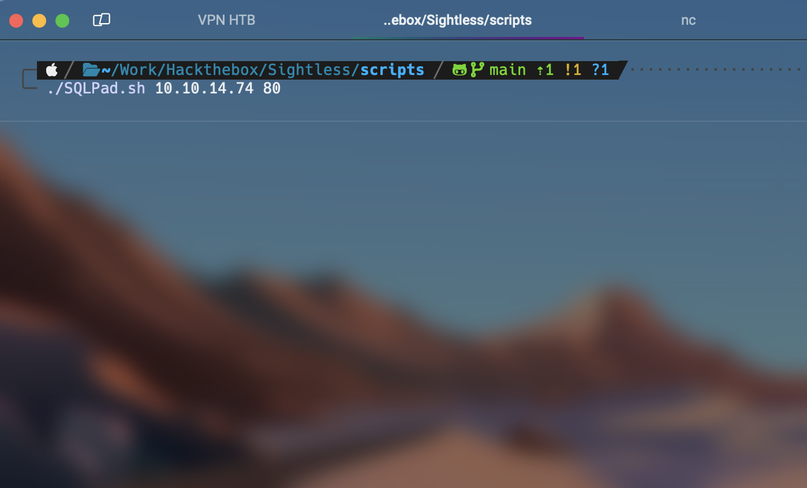
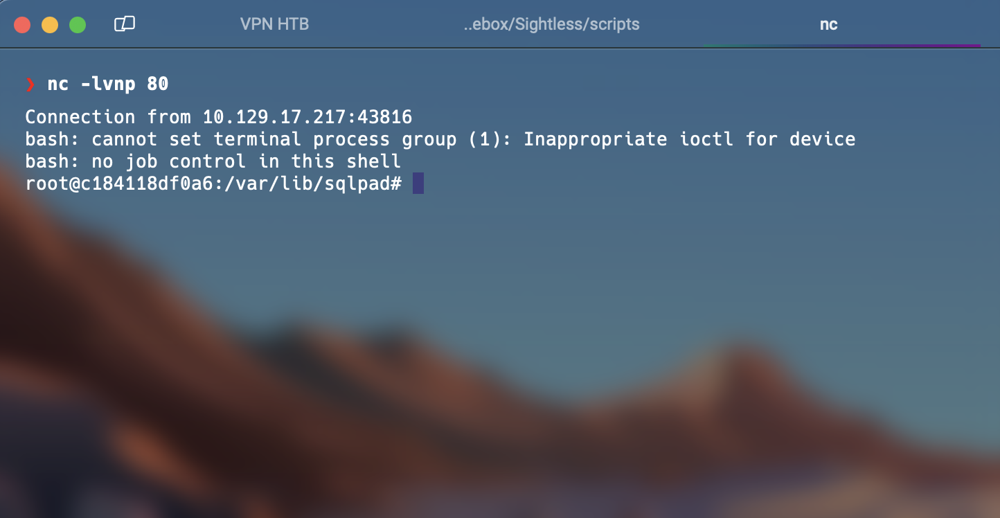

# RCE Exploit for SQLPad 6.10.0

This is an exploit for SQLPad version 6.10.0, written in Bash, that exploits a vulnerability in the SQLPad server. The exploit allows remote code execution (RCE) by manipulating the SQLPad server configuration.

## Description

SQLPad 6.10.0 has a vulnerability that allows an attacker to execute arbitrary commands on the server. This exploit is designed to leverage this vulnerability by sending a specially crafted request to the SQLPad server. The provided Bash script facilitates the exploitation of this vulnerability by automating the request sending process and the necessary configuration.

### Features

- **Automated Exploitation**: The exploit automatically handles the exploitation of the vulnerability in SQLPad.
- **Easy to Use**: Requires only the server's IP address and port to run the exploit.

### Usage/Examples

To use the exploit, simply run the `sqlpad` script with the SQLPad server's IP address and port as parameters. Here is an example of usage:

```bash
./sqlpad 127.0.0.1 80
```
### Exaple:



